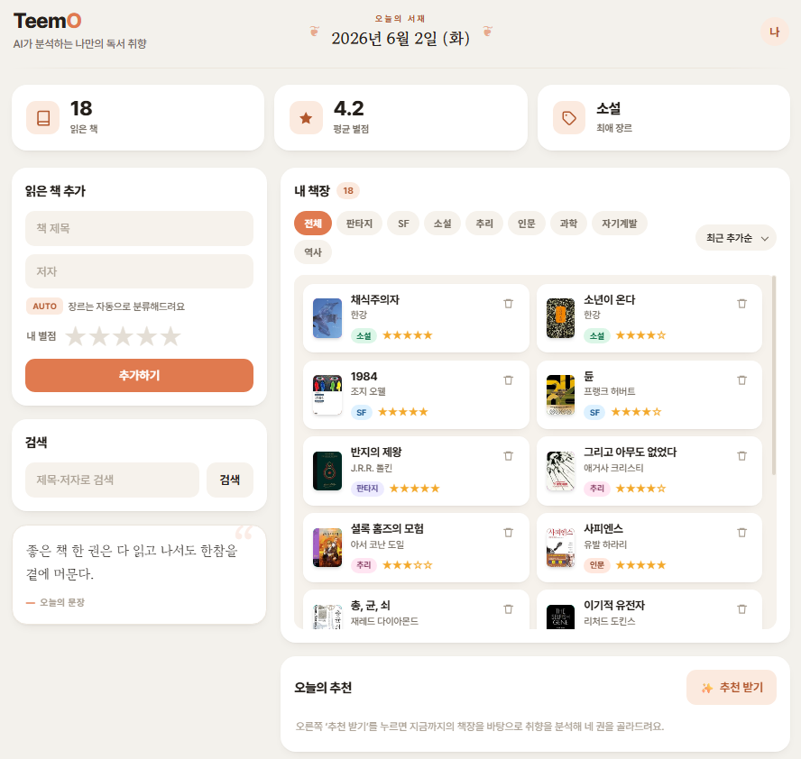
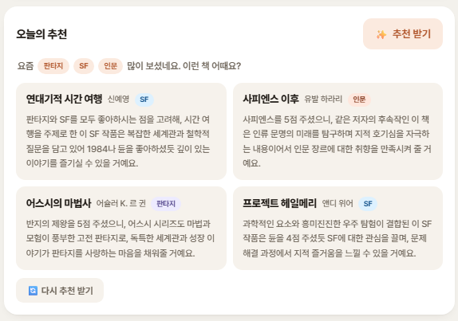

# TeemO

[](https://github.com/aqhiopmens/TeemO/actions/workflows/ci.yml)

**2026-1 Algorithms Team Project — AI-based Book Preference Analysis & Recommendation**

Add the books you've read with a 1–5 rating; TeemO analyzes your taste with classic
algorithms (Merge Sort, Hashing, Greedy, KMP, Levenshtein) and uses the **Upstage Solar**
LLM to recommend four books with reasons.

### Features
- 📖 **Add a book** → genre auto-classified by the LLM, cover fetched live (Kakao → Google Books)
- 🔍 **Search by title or author** → KMP exact match + typo-tolerant "did you mean?" (Levenshtein)
- 🚫 **Duplicate prevention** (normalized key, race-safe)
- 📚 **Smart shelf** → sort, genre filters, lazy 8-at-a-time loading; stats dashboard
- 🤖 **AI recommendations** → 4 personalized picks; "recommend again" returns fresh books

---

## Demo

📹 **[▶ Watch the demo on YouTube](https://youtu.be/DPBXUzClvoU)**

<a href="https://youtu.be/DPBXUzClvoU"></a>

| 책장 + 통계 대시보드 | AI 추천 (4권) |
|:--:|:--:|
|  |  |
| **검색 — 제목·저자 + 오타 교정** | **책 추가 — 자동 장르·표지** |
|  |  |

---

## Tech Stack
- **Backend:** Python 3 · Flask 3 · flask-cors
- **Frontend:** Vanilla HTML / CSS / JavaScript (no framework)
- **LLM:** Upstage Solar (`solar-pro`) via REST API
- **External APIs:** Kakao Book Search · Google Books (book covers)
- **Storage:** in-memory (Python list)
- **Tooling:** GitHub Actions CI · Python `unittest`

## Project Structure

```
TeemO/
├── backend/
│   ├── app.py                  # Flask REST API (4 endpoints)
│   ├── algorithms/
│   │   ├── merge_sort.py       # Sort books by rating (stable)
│   │   ├── hashing.py          # Genre-keyed hash table (separate chaining)
│   │   ├── greedy.py           # Genre preference scoring
│   │   ├── kmp.py              # Exact title/author search (KMP)
│   │   └── levenshtein.py      # Edit distance (DP) — fuzzy search fallback
│   ├── llm/
│   │   └── solar.py            # Upstage Solar client (classify + recommend)
│   ├── integrations/
│   │   ├── book_covers.py      # Unified cover lookup: Kakao → Google Books
│   │   ├── kakao_books.py      # Kakao Book Search (best for Korean books)
│   │   ├── google_books.py     # Google Books (international / classics)
│   │   └── _match.py           # Shared title/author precision check
│   ├── tests/                  # unittest suite (algorithms, endpoints, LLM)
│   ├── seed_demo.py            # Populate a demo library via the API
│   └── requirements.txt
├── frontend/
│   ├── index.html              # dashboard: add / search / shelf / recommendations
│   ├── style.css
│   └── script.js               # apiFetch, escapeHtml (XSS-safe), renderStars
├── .github/workflows/ci.yml    # CI: run tests on Python 3.11 & 3.12
├── .env                        # (not committed) API keys — see Setup
└── README.md
```

## Setup

```bash
# 1. Create and activate a virtual environment
python -m venv venv
venv\Scripts\activate          # Windows
# source venv/bin/activate     # macOS / Linux

# 2. Install dependencies
pip install -r backend/requirements.txt

# 3. Create .env in the project root (UPSTAGE_API_KEY is required)
echo UPSTAGE_API_KEY=your_key_here > .env
# (optional) book covers — looked up via Kakao first, then Google Books.
# Without these, covers simply fall back to a colour block.
#   Kakao : developers.kakao.com  → REST API key
#   Google: Google Cloud → enable "Books API" → API key
echo KAKAO_REST_API_KEY=your_key_here >> .env
echo GOOGLE_BOOKS_API_KEY=your_key_here >> .env
```

> `UPSTAGE_API_KEY` only is enough to run the app; the two cover keys are optional.

## Running the App

```bash
# 1. Start the backend (http://localhost:5000)
cd backend
python app.py

# 2. Serve the frontend in another terminal (http://localhost:8000)
python -m http.server 8000 --directory frontend
#    → open http://localhost:8000 in your browser

# 3. (optional) Load demo data — adds ~20 well-known books
cd backend
python seed_demo.py            # python seed_demo.py 15  → 15 books
```

## Running Tests

The suite uses only the Python standard library `unittest` (no extra deps) and mocks all
external APIs, so it runs offline with no API keys.

```bash
cd backend
python -m unittest discover -s tests
```

98 tests cover the five algorithms, the REST endpoints, and the Solar LLM client; CI runs
them on Python 3.11 and 3.12 for every pull request.

## API Endpoints

| Method | Path | Description |
|--------|------|-------------|
| GET | `/api/books` | List all books, Merge-Sorted by rating. Each book carries `_idx` (its storage index) so deletes target the right book despite sorting |
| POST | `/api/books` | Add a book `{title, author, rating}` — genre is auto-classified by Solar; a cover is looked up via Kakao → Google Books and returned as `cover_url` (`null` if not found) |
| DELETE | `/api/books/<idx>` | Delete a book by its storage index |
| GET | `/api/search?q=<query>` | Search **title or author** — KMP exact match, else Levenshtein fuzzy fallback. Returns `{results, matched_by, did_you_mean}` |
| GET | `/api/recommendations` | Run the recommendation pipeline (Merge Sort → Hashing → Greedy → Solar). Optional repeated `exclude` params skip already-shown titles so "recommend again" returns fresh books |

## Algorithm Concepts Applied

The course's algorithm paradigms are applied where they do real work — sorting,
hashing, greedy, string matching, and dynamic programming.

### 1. Merge Sort — Divide & Conquer (`algorithms/merge_sort.py`)
- **Where:** sort the book list by rating (descending) before analysis and for `GET /api/books`
- **Method:** recursively split the list and merge in order; **stable** (equal ratings keep insertion order)
- **Complexity:** O(n log n)

### 2. Hash Table with Separate Chaining (`algorithms/hashing.py`)
- **Where:** group books by genre and compute the top-3 preferred genres
- **Hash function:** `sum(ord(c) for c in genre) % table_size`; collisions resolved by chaining
- **Complexity:** O(1) average for insert and lookup

### 3. Greedy Preference Scoring (`algorithms/greedy.py`)
- **Where:** turn the reading history into a numeric taste profile
- **Method:** single greedy pass accumulating `rating × rank-bonus` per genre, then normalize
- **Complexity:** O(n)

### 4. KMP String Search (`algorithms/kmp.py`)
- **Where:** exact substring search over **title and author** in `GET /api/search`
- **Method:** Knuth–Morris–Pratt with an LPS (Longest Proper Prefix-Suffix) table → no backtracking
- **Complexity:** O(n + m) (n = text length, m = pattern length)

### 5. Levenshtein Distance — Dynamic Programming (`algorithms/levenshtein.py`)
- **Where:** typo-tolerant fuzzy fallback when KMP finds nothing — powers the "did you mean…?" suggestion
- **Method:** bottom-up 2-D DP table; `dp[i][j]` = edit distance between prefixes, minimizing insert / delete / substitute
- **Complexity:** O(m × n)

## Team

| Role | Member |
|---|---|
| Backend / Algorithms | 김강민 |
| Frontend | 서은빈 |
| LLM / Prompt | 박병진 |
| PM | 오세준 |
